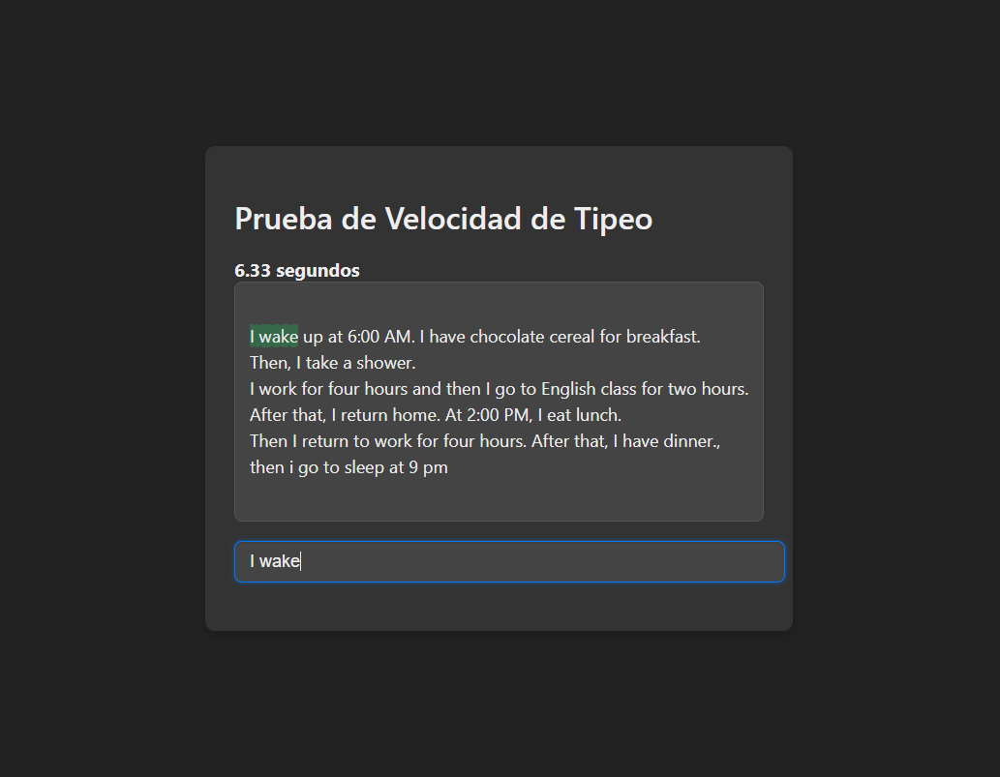

# Prueba de Velocidad de Tipeo
## Introducción
La prueba de velocidad de tipeo es una aplicación web que mide la velocidad y precisión de un usuario al escribir un texto determinado.

## Funcionalidad
La aplicación muestra un texto que el usuario debe escribir en un campo de texto. A medida que el usuario escribe, la aplicación muestra el texto con los errores resaltados en rojo y los caracteres correctos en verde. La aplicación también muestra el tiempo transcurrido y la velocidad de tipeo en palabras por minuto (wpm).

## Código
El código está escrito en HTML, CSS y JavaScript.

### HTML
El HTML define la estructura de la página, incluyendo el campo de texto, el área de visualización del texto y el botón de inicio.

### CSS
El CSS define la presentación de la página, incluyendo los colores, fuentes y estilos.

### JavaScript
El JavaScript define la lógica de la aplicación, incluyendo la carga del texto, la detección de errores y la actualización de la interfaz de usuario.

## Funciones
La aplicación utiliza las siguientes funciones:

* `startTime`: almacena el momento en que el usuario comienza a escribir
* `endTime`: almacena el momento en que el usuario termina de escribir
* `errors`: almacena el número de errores cometidos por el usuario
* `elapsedTime`: almacena el tiempo transcurrido desde que el usuario comenzó a escribir
* `timerInterval`: almacena el intervalo de tiempo utilizado para actualizar la interfaz de usuario

## Eventos
La aplicación utiliza los siguientes eventos:

* `input`: se dispara cuando el usuario escribe algo en el campo de texto
* `clearInterval`: se dispara cuando el usuario termina de escribir y se debe detener el temporizador

## Variables
La aplicación utiliza las siguientes variables:

* `textToType`: almacena el texto que el usuario debe escribir
* `inputText`: almacena el texto que el usuario ha escrito
* `displayedText`: almacena el texto que se muestra en la interfaz de usuario
* `wpm`: almacena la velocidad de tipeo en palabras por minuto

## Mejoras
La aplicación puede ser mejorada de la siguiente manera:

* Agregar más textos para que el usuario pueda practicar
* Agregar un sistema de puntuación para que el usuario pueda competir con otros
* Agregar un gráfico para mostrar la velocidad de tipeo del usuario en función del tiempo
